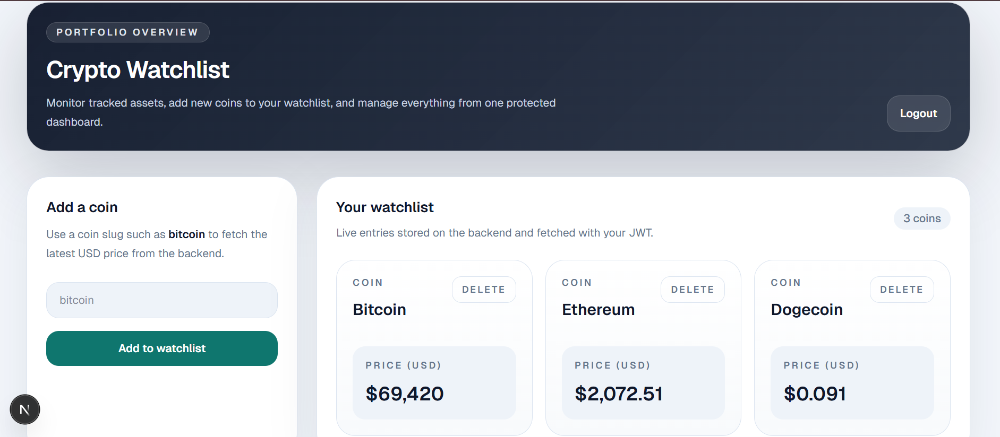

# 🚀 Crypto Watchlist API (Full Stack)

# Overview
A full-stack application built with FastAPI and Next.js that allows users to securely manage a crypto watchlist with real-time pricing.

# Tech Stack
 Backend
- FastAPI
- SQLAlchemy
- SQLite (can be replaced with PostgreSQL)
- JWT Authentication
- Pydantic Validation

 Frontend
- Next.js (App Router)
- Tailwind CSS
- Axios

# Features
# Authentication
- User Registration & Login
- JWT-based authentication
- Password hashing (bcrypt)

# Watchlist
- Add coins
- View watchlist
- Delete coins
- Fetch real-time prices (CoinGecko API)

# Security
- Protected routes
- Role-based access (admin)
- Input validation

# Backend Quality
- API versioning (`/api/v1`)
- Error handling with proper status codes
- Logging
- Modular architecture

# Frontend
- Clean dashboard UI
- Protected routes
- Loading states & error handling

# API Endpoints

Auth
- POST `/api/v1/auth/register`
- POST `/api/v1/auth/login`

 Watchlist
- GET `/api/v1/watchlist/`
- POST `/api/v1/watchlist/add`
- DELETE `/api/v1/watchlist/{id}`

# Setup

Backend Setup-
cd backend
python -m venv venv
venv\Scripts\activate   # (Windows)
# source venv/bin/activate  (Mac/Linux)

pip install -r requirements.txt
uvicorn app.main:app --reload

Backend will run on:
👉 http://127.0.0.1:8000

Frontend Setup-
cd frontend
npm install
npm run dev

Frontend will run on:
👉 http://localhost:3000

Running Tests
pytest

 Screenshots

 Scalability Note
The system is designed using a modular architecture, making it easy to scale into microservices. Authentication, watchlist, and external API services can be separated. For scalability, caching (Redis), load balancing, and database indexing can be introduced.

👨‍💻 Author
Tanushree Nerella
